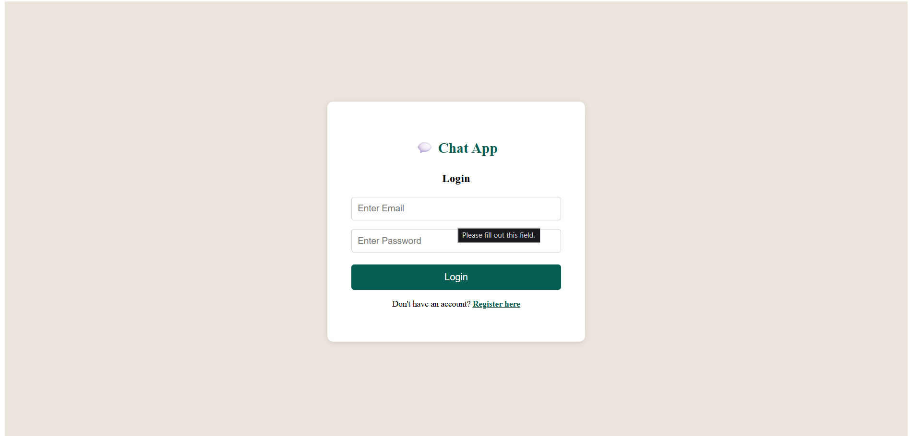
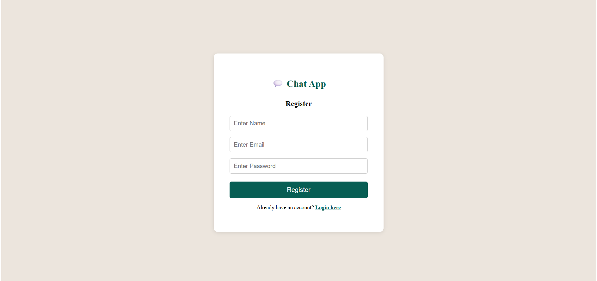
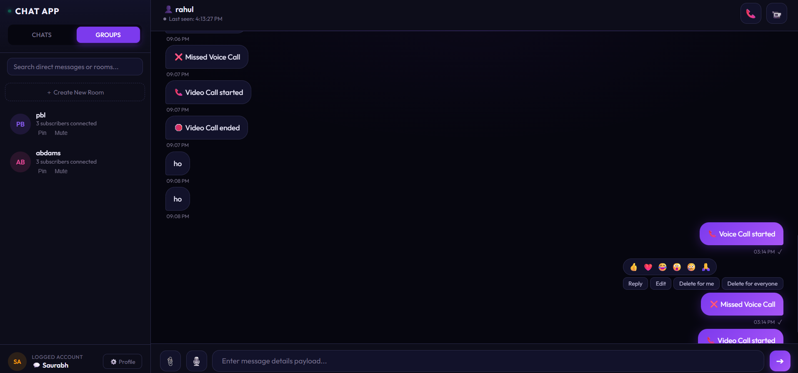
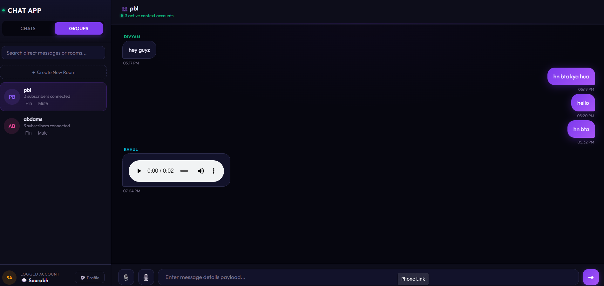

# Real-Time Chat Application

A full-stack real-time chat application built using React, Node.js, Express, MongoDB, Socket.io, and WebRTC.

## Screenshots

### Login Page

### Registration Page

### Chat Interface
cat README.md

### Calling Feature

